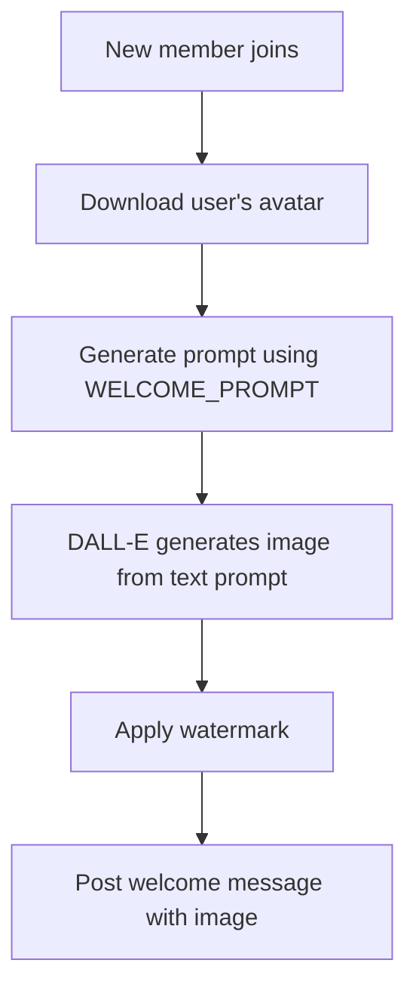
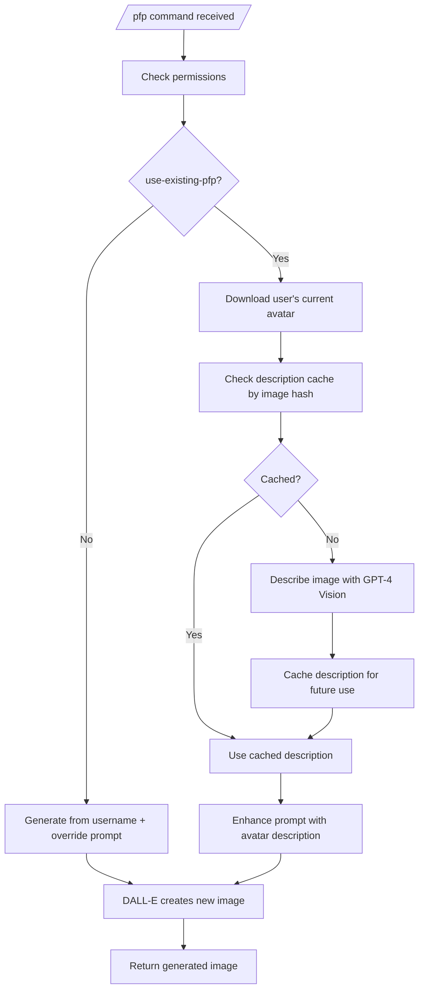
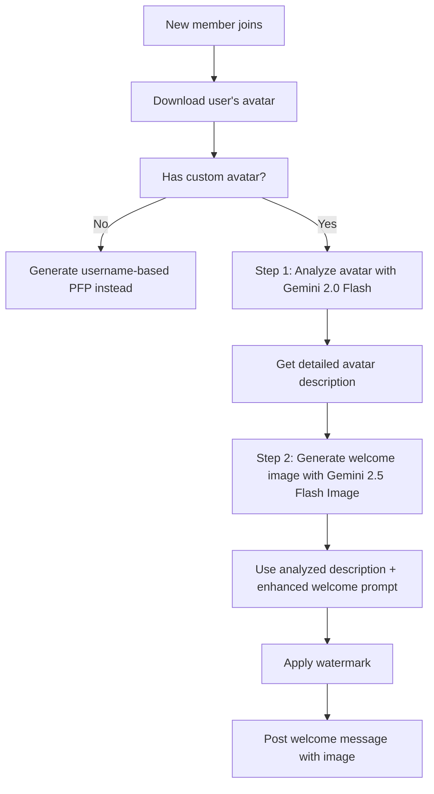
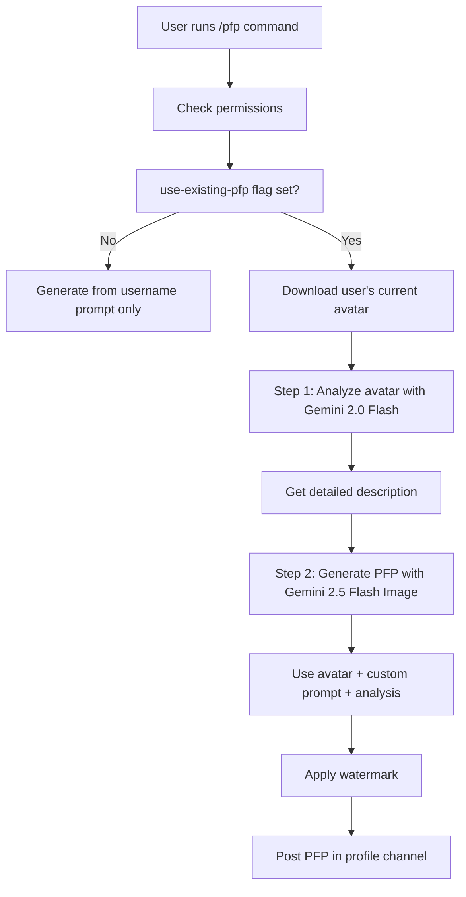
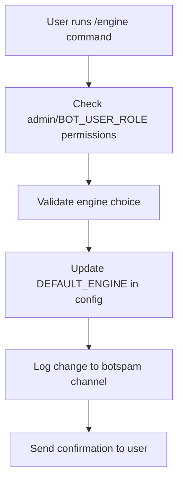
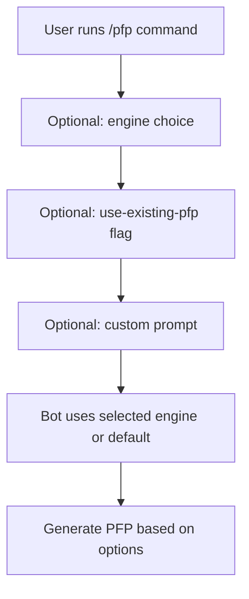
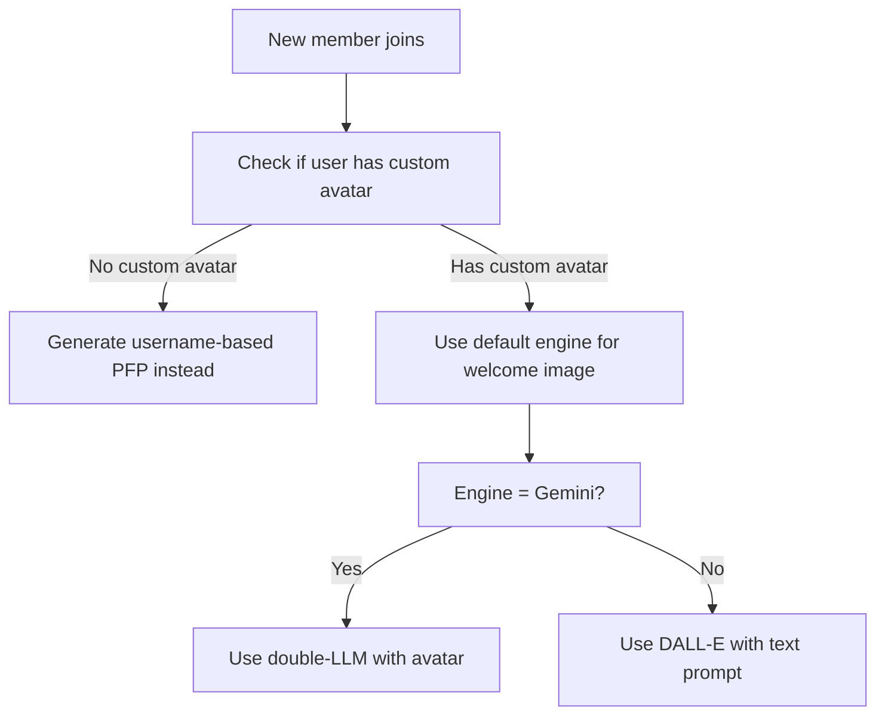
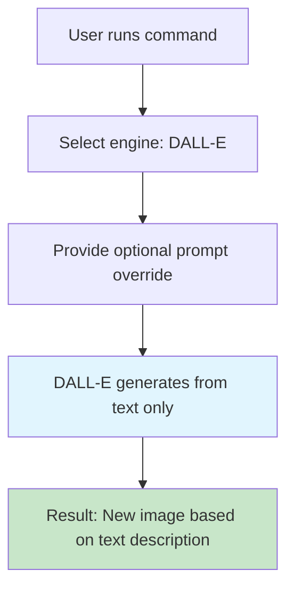
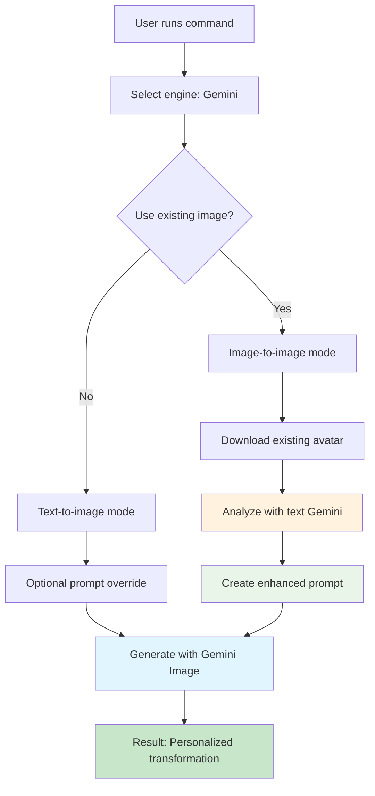

# 🎨 Image Generation Flows: DALL-E vs Gemini Engines

> **"Show, don't tell"** - This page demonstrates the actual differences between DALL-E and Gemini image generation engines through real examples and flowcharts.

The bot supports two image generation engines with fundamentally different approaches:

- **DALL-E 3** (OpenAI): Traditional text-to-image generation
- **Gemini 2.5 Flash Image** (Google): Advanced multimodal image-to-image with double-LLM analysis

## ⚡ Engine Comparison Overview

| Feature | DALL-E 3 | Gemini 2.5 Flash Image |
|---------|----------|----------------------|
| **Input Type** | Text prompts only | Text + Image inputs |
| **Welcome Images** | Username-based description | Avatar analysis + enhancement |
| **Profile Pictures** | Text-to-image | Image-to-image transformation |
| **use-existing-pfp** | Image description + generation | Direct image-to-image |
| **Customization** | Override prompts | Override prompts + existing image |
| **Cost** | $0.04/image (1024×1024) | Limited free (~2/day), $0.039/image paid |
| **Speed** | Fast | Slower (double analysis) |

## 🎯 Production Behavior by Default Engine

### When DALL-E is Default Engine

#### Welcome Images Flow


**Strategy**: Creates welcome images based on username descriptions only. Avatar is downloaded but not used for generation.

#### Profile Pictures Flow


**Strategy**: Text-to-image generation with optional avatar description enhancement. When `use-existing-pfp` is enabled, DALL-E describes the user's current avatar (with caching to avoid redundant API calls) and incorporates that description into the generation prompt for more personalized results.

### When Gemini is Default Engine

#### Welcome Images


**Double-LLM Strategy**:
1. **Analysis Phase**: `gemini-2.0-flash` analyzes the avatar image and returns a concise description (≤15 words)
2. **Generation Phase**: `gemini-2.5-flash-image` uses the avatar image + enhanced prompt: `"Using the input image as reference: [analysis result]. Create a welcome image for [username] proclaimed upon and incorporated into a cyberpunk billboard in a mixture of synthwave and cyberpunk styles."`

#### Profile Pictures (/pfp command)


**Double-LLM Strategy**:
1. **Analysis Phase**: `gemini-2.0-flash` analyzes the user's current avatar
2. **Generation Phase**: `gemini-2.5-flash-image` creates a new PFP based on the original avatar + user's custom prompt

## Engine Comparison Matrix

| Feature | DALL-E 3 | Gemini 2.5 Flash Image |
|---------|----------|----------------------|
| **Input Type** | Text only | Text + Image (multimodal) |
| **Welcome Images** | Text prompt with avatar description | Direct avatar image + enhanced prompt |
| **Profile Pictures** | Username-based generation | Avatar-based transformation |
| **Customization** | Limited to text prompts | Image-to-image editing |
| **Quality** | High consistency | Better subject preservation |
| **Cost** | Paid API (~$0.04/image) | Limited free tier (~2 images/day) |

## User Customization Flows

### Setting Default Engine


**Command**: `/engine engine:(DALL-E/OpenAI or Gemini/Google)`

### Profile Picture Customization


**Available Options**:
- `engine`: Override default engine for this command
- `use-existing-pfp`: Use current avatar as base (Gemini only)
- `prompt`: Custom text prompt (appends to/overrides default)

### Welcome Image Behavior


## Technical Implementation Details

### Gemini Double-LLM Process

#### Step 1: Image Analysis
```javascript
// Using gemini-2.0-flash (text model)
const analysisPrompt = "Describe this image concisely in 15 words or less, focusing on the main subject, their appearance, and key visual characteristics.";
const analysis = await geminiTextModel.generateContent([analysisPrompt, imageData]);
```

#### Step 2: Enhanced Generation for Welcome Images
```javascript
// Using gemini-2.5-flash-image (multimodal model)
const enhancedPrompt = `Using the input image as reference: ${analysis}. Create a welcome image for ${username} proclaimed upon and incorporated into a cyberpunk billboard in a mixture of synthwave and cyberpunk styles.`;
const result = await geminiImageModel.generateContent([enhancedPrompt, imageData]);
```

#### Step 2: Enhanced Generation for PFP Transformations
```javascript
// Using gemini-2.5-flash-image (multimodal model)
const enhancedPrompt = `Using the input image as reference: ${analysis}. ${userPrompt}`;
const result = await geminiImageModel.generateContent([enhancedPrompt, imageData]);
```

### Configuration Variables

```javascript
// Environment variables
const WELCOME_PROMPT = "Create a welcome image for {username} proclaimed upon and incorporated into a cyberpunk billboard in a mixture of synthwave and cyberpunk styles.";
const DEFAULT_ENGINE = process.env.DEFAULT_ENGINE || 'dalle';
const GEMINI_API_KEY = process.env.GEMINI_API_KEY;
const OPENAI_API_KEY = process.env.OPENAI_API_KEY;
```

## 🎨 **Real Examples: Engine Differences in Action**

> **The proof is in the images.** Below are actual generated examples showing how the same input produces different results with each engine.

### Example 1: Welcome Image Generation

**Input**: Discord user "TestUser123" joins with this profile picture:


**DALL-E 3 Result** (Text-only generation):
- **Prompt**: "Create a welcome image for TestUser123 proclaimed upon and incorporated into a cyberpunk billboard in a mixture of synthwave and cyberpunk styles."
- **Process**: Pure text-to-image, no avatar analysis
- **Result**: Generic cyberpunk billboard with username text overlay

**Gemini Result** (Double-LLM multimodal):
- **Step 1 Analysis**: "A person with a thoughtful expression and short dark hair wearing glasses"
- **Step 2 Enhanced Prompt**: "Using the input image as reference: A person with a thoughtful expression and short dark hair wearing glasses. Create a welcome image for TestUser123 proclaimed upon and incorporated into a cyberpunk billboard in a mixture of synthwave and cyberpunk styles."
- **Process**: Avatar analysis → personalized image generation
- **Result**: Billboard incorporating actual avatar features with personalized styling

### Example 2: Profile Picture Customization

**Input**: Same user wants a "superhero version" of their PFP

**DALL-E 3 Result** (Text-only):
- **Prompt**: "Create a superhero version of TestUser123's profile picture with cape and powers"
- **Process**: Generates from scratch based on username description
- **Result**: Generic superhero character (may not resemble original user)

**Gemini Result** (Image-to-image with `use-existing-pfp`):
- **Step 1 Analysis**: "A person with a thoughtful expression and short dark hair wearing glasses"
- **Step 2 Enhanced Prompt**: "Using the input image as reference: A person with a thoughtful expression and short dark hair wearing glasses. Create a superhero version with cape and powers while maintaining facial features"
- **Process**: Transforms existing avatar into superhero version
- **Result**: User's actual face/features as superhero with cape and powers

## 🔧 **User Customization Options Deep Dive**

### DALL-E Customization Flow



**Limitations**:
- Cannot use existing images as input
- All generation is from scratch
- Results may vary significantly from user's appearance

**Best For**: Creative freedom, when you want something completely new

### Gemini Customization Flow



**Advantages**:
- Can transform existing images while preserving features
- Double-LLM analysis creates more accurate results
- Personalized to user's actual appearance

**Best For**: When you want to modify your existing avatar, maintain consistency

## 📊 **Performance Comparison**

### API Costs
- **DALL-E**: $0.04 per image (1024×1024 standard)
- **Gemini**: Limited free tier (~2 images/day), $0.039 per image paid (1024×1024)

### Generation Speed
- **DALL-E**: ~10-20 seconds
- **Gemini Double-LLM**: ~15-30 seconds (two API calls)

### Quality Comparison
- **DALL-E**: High consistency, creative freedom
- **Gemini**: Better subject preservation, more personalized

## 🎯 **When to Choose Each Engine**

### Choose DALL-E When:
- You want maximum creative freedom
- Cost is not a concern
- You prefer faster generation
- You're creating something completely new

### Choose Gemini When:
- You want to transform existing images
- Personalization is important
- You have limited budget (free tier)
- Subject consistency matters

---

**Ready to try it?** Set your default engine with `/engine` and experiment with `/pfp` and `/welcome` commands!

## 🔗 **Quick Links**
- [← Back to README.md](../README.md) - Main documentation
- [🐳 Docker Deployment](../README.md#deployment) - How to run the bot
- [⚙️ Environment Setup](../README.md#environment-variables) - Configuration guide

---

*This documentation shows the actual differences between engines through examples and flowcharts, helping users understand which engine best fits their needs.*
