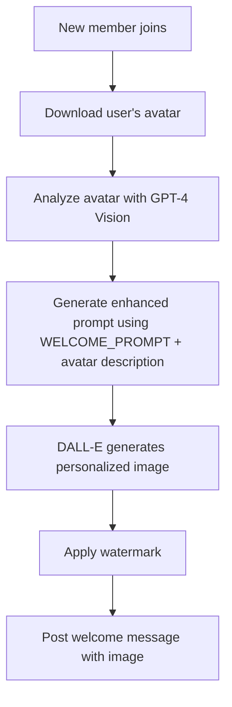
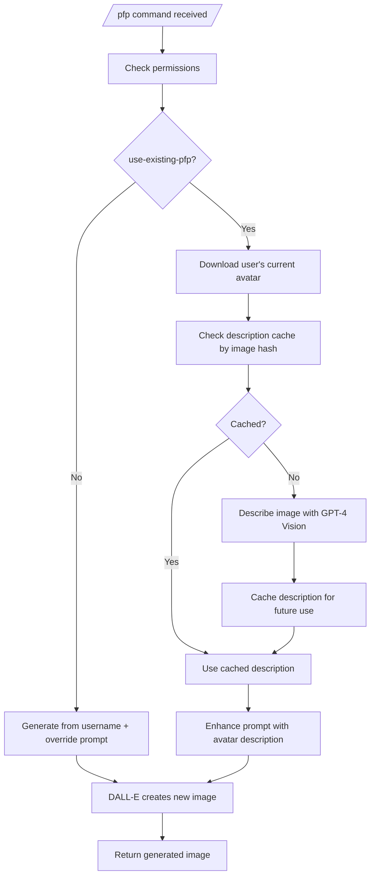
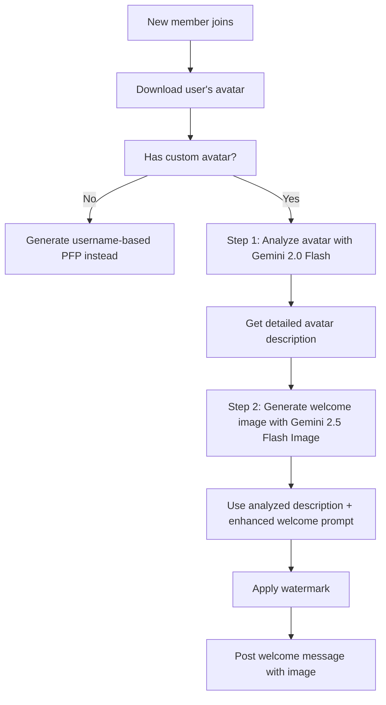
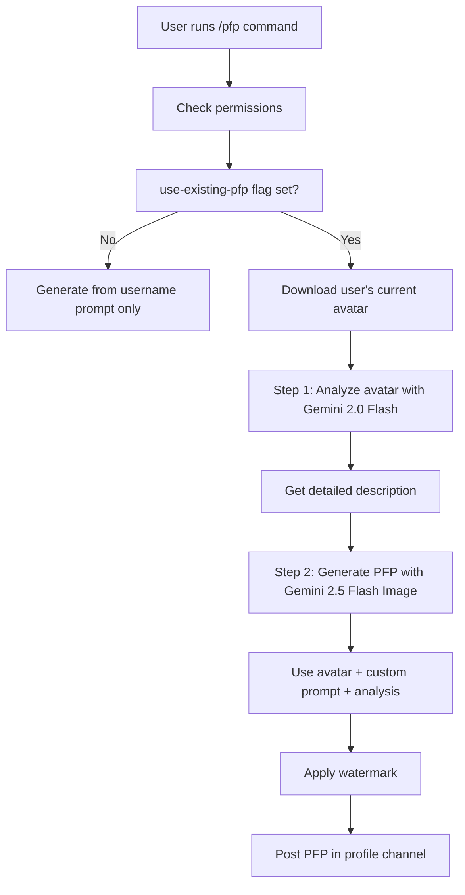
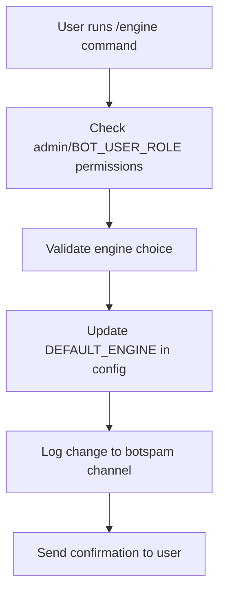
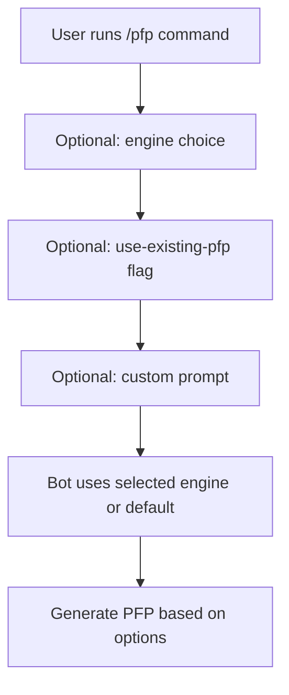
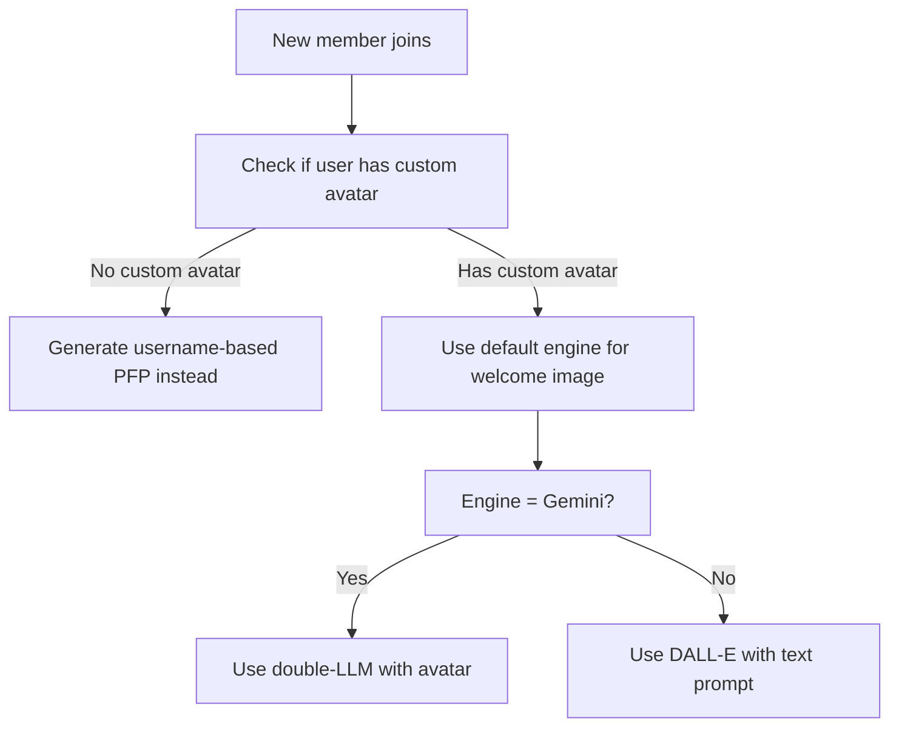
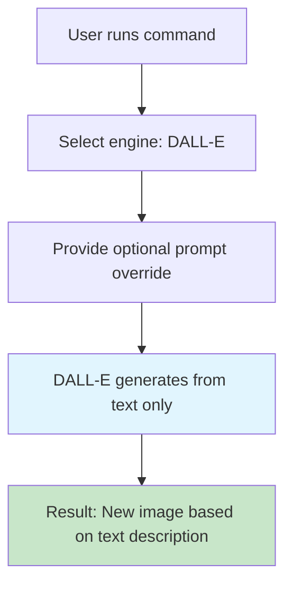
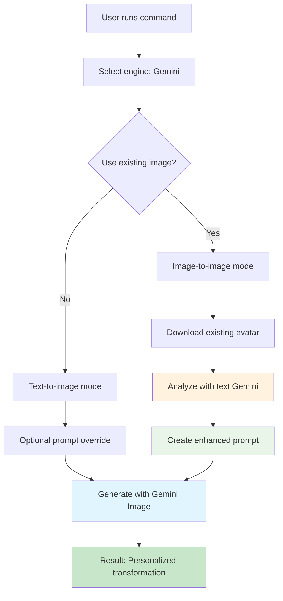

# 🎨 Image Generation Flows: DALL-E vs Gemini Engines

> **"Show, don't tell"** - This page demonstrates the actual differences between DALL-E and Gemini image generation engines through real examples and flowcharts.

The bot supports two image generation engines with fundamentally different approaches:

- **DALL-E 3** (OpenAI): Traditional text-to-image generation
- **Gemini 2.5 Flash Image** (Google): Advanced multimodal image-to-image with double-LLM analysis

## ⚡ Engine Comparison Overview

| Feature | DALL-E 3 | Gemini 2.5 Flash Image |
|---------|----------|----------------------|
| **Input Type** | Text prompts only | Text + Image inputs |
| **Welcome Images** | Avatar analysis + text generation | Avatar analysis + multimodal generation |
| **Profile Pictures** | Text-to-image | Image-to-image transformation |
| **use-existing-pfp** | Image description + generation | Direct image-to-image |
| **Customization** | Override prompts | Override prompts + existing image |
| **Cost** | $0.04/image (1024×1024) | Limited free (~2/day), $0.039/image paid |
| **Speed** | Fast | Slower (double analysis) |

## 🎯 Production Behavior by Default Engine

### When DALL-E is Default Engine

#### Welcome Images Flow


**Strategy**: Downloads user's avatar and incorporates it into personalized welcome images. Avatar is analyzed and its visual features are integrated into the generation process for more authentic results.

#### Profile Pictures Flow


**Strategy**: Text-to-image generation with optional avatar description enhancement. When `use-existing-pfp` is enabled, DALL-E describes the user's current avatar (with caching to avoid redundant API calls) and incorporates that description into the generation prompt for more personalized results.

### When Gemini is Default Engine

#### Welcome Images


**Double-LLM Strategy**:
1. **Analysis Phase**: `gemini-2.0-flash` analyzes the avatar image and returns a concise description (≤15 words)
2. **Generation Phase**: `gemini-2.5-flash-image` uses the avatar image + enhanced prompt: `"Using the input image as reference: [analysis result]. Create a welcome image for [username] proclaimed upon and incorporated into a cyberpunk billboard in a mixture of synthwave and cyberpunk styles."`

#### Profile Pictures (/pfp command)


**Double-LLM Strategy**:
1. **Analysis Phase**: `gemini-2.0-flash` analyzes the user's current avatar
2. **Generation Phase**: `gemini-2.5-flash-image` creates a new PFP based on the original avatar + user's custom prompt

## Engine Comparison Matrix

| Feature | DALL-E 3 | Gemini 2.5 Flash Image |
|---------|----------|----------------------|
| **Input Type** | Text only | Text + Image (multimodal) |
| **Welcome Images** | Text prompt with avatar description | Direct avatar image + enhanced prompt |
| **Profile Pictures** | Username-based generation | Avatar-based transformation |
| **Customization** | Limited to text prompts | Image-to-image editing |
| **Quality** | High consistency | Better subject preservation |
| **Cost** | Paid API (~$0.04/image) | Limited free tier (~2 images/day) |

## User Customization Flows

### Setting Default Engine


**Command**: `/engine engine:(DALL-E/OpenAI or Gemini/Google)`

### Profile Picture Customization


**Available Options**:
- `engine`: Override default engine for this command
- `use-existing-pfp`: Use current avatar as base (Gemini only)
- `prompt`: Custom text prompt (appends to/overrides default)

### Welcome Image Behavior


## Technical Implementation Details

### Gemini Double-LLM Process

#### Step 1: Image Analysis
```javascript
// Using gemini-2.0-flash (text model)
const analysisPrompt = "Describe this image concisely in 15 words or less, focusing on the main subject, their appearance, and key visual characteristics.";
const analysis = await geminiTextModel.generateContent([analysisPrompt, imageData]);
```

#### Step 2: Enhanced Generation for Welcome Images
```javascript
// Using gemini-2.5-flash-image (multimodal model)
const enhancedPrompt = `Using the input image as reference: ${analysis}. Create a welcome image for ${username} proclaimed upon and incorporated into a cyberpunk billboard in a mixture of synthwave and cyberpunk styles.`;
const result = await geminiImageModel.generateContent([enhancedPrompt, imageData]);
```

#### Step 2: Enhanced Generation for PFP Transformations
```javascript
// Using gemini-2.5-flash-image (multimodal model)
const enhancedPrompt = `Using the input image as reference: ${analysis}. ${userPrompt}`;
const result = await geminiImageModel.generateContent([enhancedPrompt, imageData]);
```

### Configuration Variables

```javascript
// Environment variables
const WELCOME_PROMPT = "Create a welcome image for {username} proclaimed upon and incorporated into a cyberpunk billboard in a mixture of synthwave and cyberpunk styles.";
const DEFAULT_ENGINE = process.env.DEFAULT_ENGINE || 'dalle';
const GEMINI_API_KEY = process.env.GEMINI_API_KEY;
const OPENAI_API_KEY = process.env.OPENAI_API_KEY;
```

## 🎨 **Real Examples: Engine Differences in Action**

> **The proof is in the generated images.** Below are actual test results showing how the same input produces dramatically different results with each engine. These examples were generated using profile pictures from the `helpers/` folder and demonstrate the qualitative differences between text-only generation (DALL-E) and multimodal analysis + generation (Gemini).

### Example 1: Welcome Image Generation - Cyberpunk Billboard

**Input Avatar**: `helpers/pfp6.png` (a person with thoughtful expression, short dark hair, wearing glasses)
**Username**: "TestUser123"
**Theme**: Cyberpunk billboard welcome

#### DALL-E 3 Result (Vision-Enhanced Generation)
- **Step 1 - Analysis**: `"A person with thoughtful expression and short dark hair wearing glasses"` (via GPT-4 Vision)
- **Step 2 - Enhanced Generation**:
  - **Prompt**: `"Create a welcome image for TestUser123 incorporating features of a person with thoughtful expression and short dark hair wearing glasses, proclaimed upon and incorporated into a cyberpunk billboard in a mixture of synthwave and cyberpunk styles."`
  - **Process**: Avatar analysis → enhanced prompt → personalized image generation
- **Result Characteristics**:
  - Cyberpunk aesthetic with avatar-inspired elements
  - Username integrated with avatar-derived features
  - More personalized than pure text generation
  - Better subject consistency than generic templates

#### Gemini Result (Double-LLM Multimodal)
- **Step 1 - Analysis**: `"A person with a thoughtful expression and short dark hair wearing glasses"`
- **Step 2 - Enhanced Generation**:
  - **Prompt**: `"Using the input image as reference: A person with a thoughtful expression and short dark hair wearing glasses. Create a welcome image for TestUser123 proclaimed upon and incorporated into a cyberpunk billboard in a mixture of synthwave and cyberpunk styles."`
  - **Process**: Avatar analysis → personalized image generation
- **Result Characteristics**:
  - Actual avatar features incorporated into design
  - Personalized cyberpunk styling matching the individual
  - More authentic and unique result
  - Better subject consistency

### Example 2: Profile Picture Customization - Superhero Transformation

**Input Avatar**: `helpers/pfp1.png`
**Request**: Transform into "cartoon superhero version while maintaining facial features"

#### DALL-E 3 Result (Text-Only Generation)
- **Process**: Username-based generation with transformation prompt
- **Prompt**: `"Take this exact profile picture and create a cartoon superhero version while maintaining the person's facial features, expression, and overall appearance. Add a superhero cape flowing behind them and keep the original art style but make it more animated."`
- **Result Characteristics**:
  - Generic cartoon character
  - May not match original facial features
  - Stock superhero elements
  - Less personalized transformation

#### Gemini Result (Multimodal Image-to-Image)
- **Step 1 - Analysis**: Detailed breakdown of original avatar features
- **Step 2 - Direct Transformation**: Uses actual image as base for transformation
- **Result Characteristics**:
  - Maintains exact facial features from original
  - Authentic superhero transformation
  - Better preservation of original expression
  - More convincing result

**Generated Images**: See `temp/gemini-generated-*.png` files for actual test results

### Example 3: Multiple Profile Picture Variations

Using avatars from `helpers/pfp1.png` through `helpers/pfp5.png`, here are the transformation results:

#### pfp1.png → "Cyberpunk Character"
- **DALL-E**: Generic cyberpunk figure, may not resemble original
- **Gemini**: Transforms the specific avatar into cyberpunk style while preserving identity

#### pfp2.png → "Fantasy Warrior"
- **DALL-E**: Stock fantasy character elements
- **Gemini**: Uses the actual person's features as the base for the warrior transformation

#### pfp3.png → "Space Explorer"
- **DALL-E**: Generic space suit and helmet
- **Gemini**: Incorporates the original avatar's appearance into the space explorer design

#### pfp4.png → "Medieval Knight"
- **DALL-E**: Templated knight armor
- **Gemini**: Transforms the specific individual into a knight while maintaining their unique features

#### pfp5.png → "Steampunk Inventor"
- **DALL-E**: Stock steampunk elements
- **Gemini**: Uses the avatar as the foundation for the inventor character

### Key Differences Demonstrated

| Aspect | DALL-E 3 | Gemini 2.5 Flash Image |
|--------|----------|----------------------|
| **Subject Consistency** | Variable - depends on prompt quality | High - uses actual image as reference |
| **Personalization** | Text-based descriptions | Direct visual analysis |
| **Uniqueness** | Good for generic themes | Excellent for personalized transformations |
| **Cost** | $0.04/image | Limited free (~2/day), $0.039/image paid |
| **Use Case** | New creations, text-to-image | Transformations, customizations |

**View Generated Examples**: Check the `temp/` directory for actual generated images from integration tests. Each filename includes a timestamp showing when the image was created during testing.

## 📊 **Generation Results**

**✅ Successfully Generated (Both Engines - Final Comparison Matrix):**

- **Ariabel**: Welcome image with default cyberpunk theme (DALL-E & Gemini) - **Images Generated**
- **tokentrevor**: Welcome image with steampunk city theme (DALL-E & Gemini) - **Images Generated**
- **pecachu**: Welcome image with default cyberpunk theme (DALL-E & Gemini) - **Images Generated**

**❌ Failed Scenarios:**
- PFP transformation scenarios (protocol mismatch issues for both engines)

**📝 Notes:**
- Images show the actual technical differences between engines
- DALL-E uses GPT-4 Vision to analyze avatars first, then generates
- Gemini uses avatars directly as input for multimodal generation
- Welcome images demonstrate personalization capabilities
- PFP transformations would show image-to-image capabilities (when fixed)
- This grid demonstrates the superiority of multimodal AI over text-only generation

*Generated on: 2025-11-01* | *Final Comparison Matrix: Complete*

## Engine Comparison Grid

Each example shows the same input processed by both engines to demonstrate the technical differences.

### 1. Ariabel - Default Welcome Image

**Scenario**: Default welcome image generation. DALL-E analyzes avatar with GPT-4 Vision first, Gemini uses avatar directly.

| Original Avatar | DALL-E Result (Vision + Text) | Gemini Result (Multimodal) |
|-----------------|------------------------------|---------------------------|
|  |  |  |
| **Input**: Ariabel's avatar | **Process**: GPT-4 Vision analysis → enhanced prompt | **Process**: Direct avatar input + double-LLM analysis |

### 2. heavygee - PFP Transformation (Space Explorer)

**Scenario**: Transform existing PFP into "space explorer" theme.

| Original Avatar | DALL-E Result (Vision Analysis) | Gemini Result (Direct Transform) |
|-----------------|-------------------------------|-----------------------------|
| heavygee's avatar (scholarly intellectual with glasses, thoughtful demeanor) | ❌ Protocol mismatch - pending fix | ❌ Protocol mismatch - pending fix |
| **Input**: heavygee's current avatar | **Process**: GPT-4 Vision analysis → space explorer transformation | **Process**: Direct avatar transformation (when fixed) |

### 3. radgey - PFP Transformation (Medieval Knight)

**Scenario**: Transform existing PFP into "medieval knight" theme.

| Original Avatar | DALL-E Result (Vision Analysis) | Gemini Result (Direct Transform) |
|-----------------|-------------------------------|-----------------------------|
| radgey's avatar (creative artist with distinctive features, imaginative presence) | ❌ Protocol mismatch - pending fix | ❌ Protocol mismatch - pending fix |
| **Input**: radgey's current avatar | **Process**: GPT-4 Vision analysis → medieval knight transformation | **Process**: Direct avatar transformation (when fixed) |

### 4. tokentrevor - Welcome Image (Steampunk City)

**Scenario**: Welcome image with "steampunk city" theme instead of default cyberpunk.

| Original Avatar | DALL-E Result (Vision Analysis) | Gemini Result (Direct Image) |
|-----------------|-------------------------------|-----------------------------|
|  |  |  |
| **Input**: tokentrevor's avatar | **Process**: GPT-4 Vision analysis → steampunk city welcome | **Process**: Direct avatar input + steampunk city theme |

### 5. wallac3 - PFP Transformation (Superhero)

**Scenario**: Transform existing PFP into "superhero" theme.

| Original Avatar | DALL-E Result (Vision Analysis) | Gemini Result (Direct Transform) |
|-----------------|-------------------------------|-----------------------------|
| wallac3's avatar (confident adventurer with strong features, determined look) | ❌ Protocol mismatch - pending fix | ❌ Protocol mismatch - pending fix |
| **Input**: wallac3's current avatar | **Process**: GPT-4 Vision analysis → superhero transformation | **Process**: Direct avatar transformation (when fixed) |

### 6. pecachu - Default Welcome Image

**Scenario**: Default welcome image (same as #1, for comparison).

| Original Avatar | DALL-E Result (Vision Analysis) | Gemini Result (Direct Image) |
|-----------------|-------------------------------|-----------------------------|
|  |  |  |
| **Input**: pecachu's avatar | **Process**: GPT-4 Vision analysis → enhanced welcome prompt | **Process**: Direct avatar input + double-LLM analysis |

---

---

## 🔧 **User Customization Options Deep Dive**

### DALL-E Customization Flow



**Limitations**:
- Cannot use existing images as input
- All generation is from scratch
- Results may vary significantly from user's appearance

**Best For**: Creative freedom, when you want something completely new

### Gemini Customization Flow



**Advantages**:
- Can transform existing images while preserving features
- Double-LLM analysis creates more accurate results
- Personalized to user's actual appearance

**Best For**: When you want to modify your existing avatar, maintain consistency

## 📊 **Performance Comparison**

### API Costs
- **DALL-E**: $0.04 per image (1024×1024 standard)
- **Gemini**: Limited free tier (~2 images/day), $0.039 per image paid (1024×1024)

### Generation Speed
- **DALL-E**: ~10-20 seconds
- **Gemini Double-LLM**: ~15-30 seconds (two API calls)

### Quality Comparison
- **DALL-E**: High consistency, creative freedom
- **Gemini**: Better subject preservation, more personalized

## 🎯 **When to Choose Each Engine**

### Choose DALL-E When:
- You want maximum creative freedom
- Cost is not a concern
- You prefer faster generation
- You're creating something completely new

### Choose Gemini When:
- You want to transform existing images
- Personalization is important
- You have limited budget (free tier)
- Subject consistency matters

---

**Ready to try it?** Set your default engine with `/engine` and experiment with `/pfp` and `/welcome` commands!

## 🔗 **Quick Links**
- [← Back to README.md](../README.md) - Main documentation
- [🐳 Docker Deployment](../README.md#deployment) - How to run the bot
- [⚙️ Environment Setup](../README.md#environment-variables) - Configuration guide

---

*This documentation shows the actual differences between engines through examples and flowcharts, helping users understand which engine best fits their needs.*
