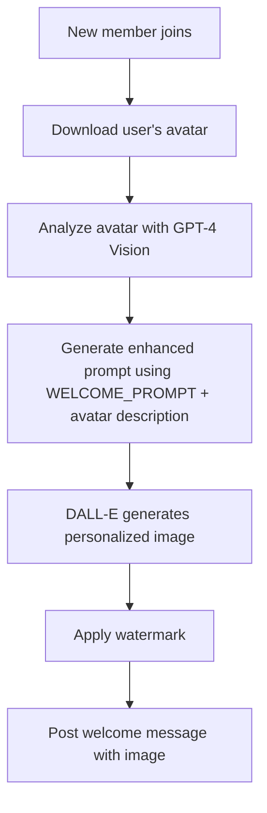
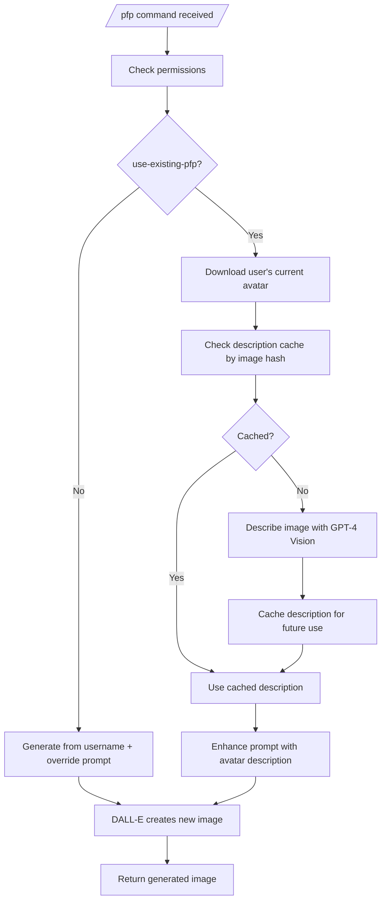
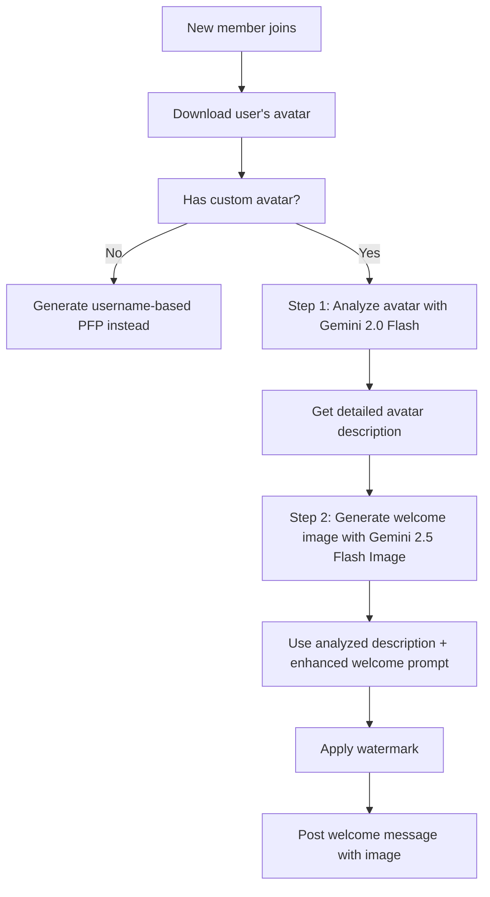
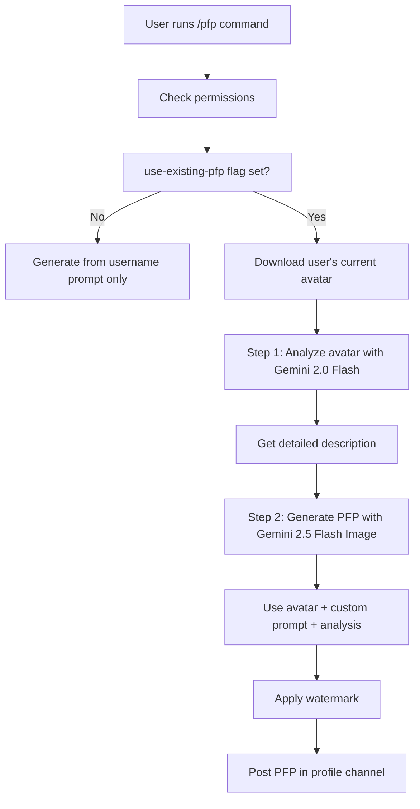
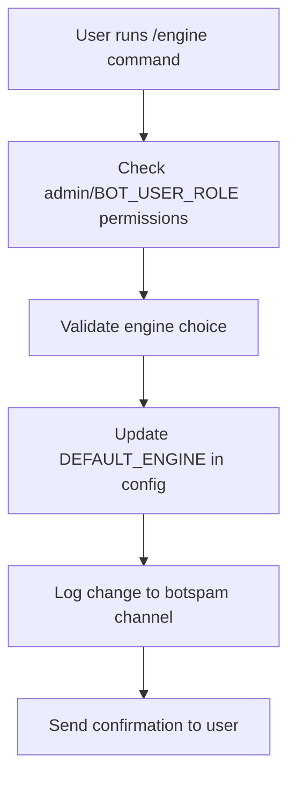
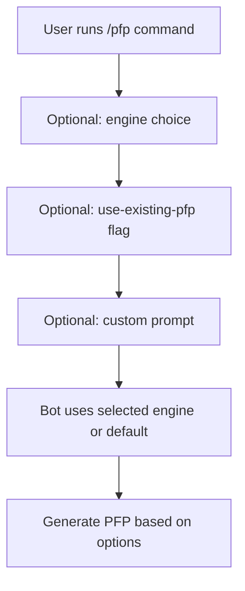
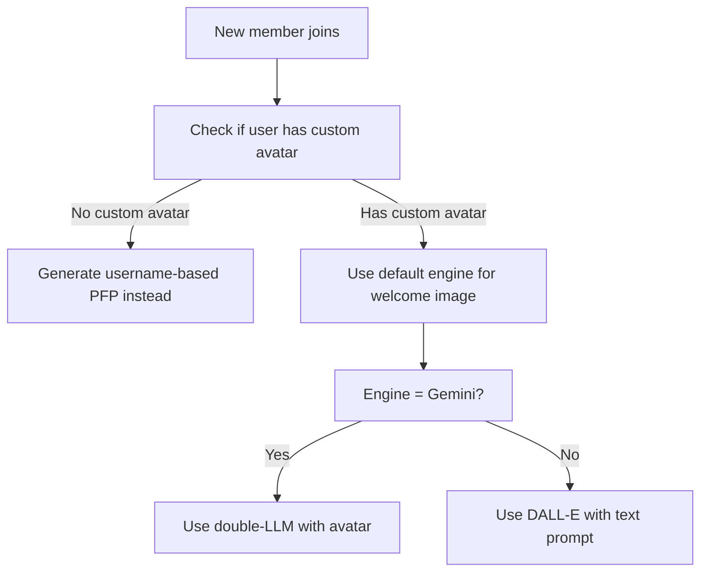
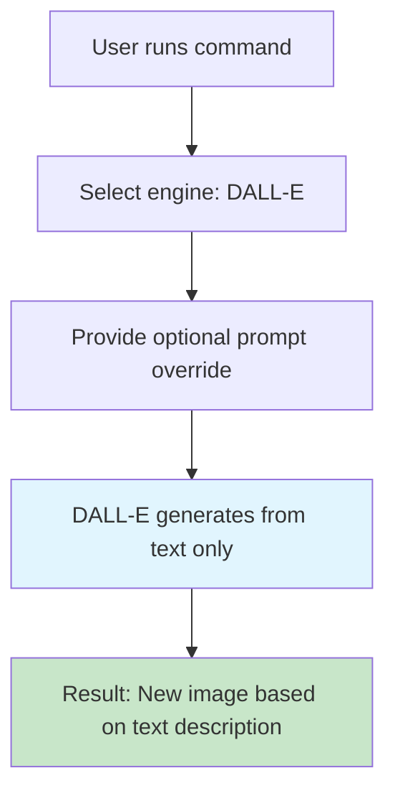
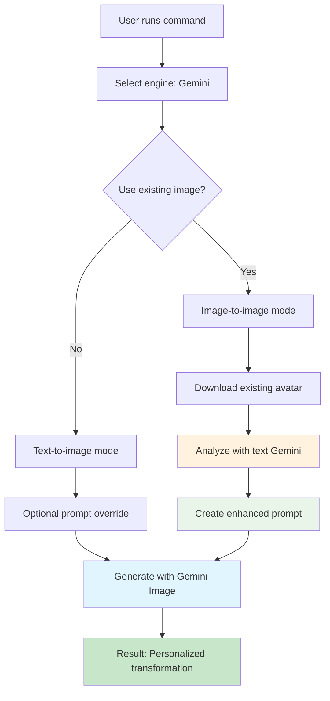

# 🎨 Image Generation Flows: DALL-E vs Gemini Engines

> **"Show, don't tell"** - This page demonstrates the actual differences between DALL-E and Gemini image generation engines through real examples and flowcharts.

The bot supports two image generation engines with fundamentally different approaches:

- **DALL-E 3** (OpenAI): Traditional text-to-image generation
- **Gemini 2.5 Flash Image** (Google): Advanced multimodal image-to-image with double-LLM analysis

## ⚡ Engine Comparison Overview

| Feature | DALL-E 3 | Gemini 2.5 Flash Image |
|---------|----------|----------------------|
| **Input Type** | Text prompts only | Text + Image inputs |
| **Welcome Images** | Avatar analysis + text generation | Avatar analysis + multimodal generation |
| **Profile Pictures** | Text-to-image | Image-to-image transformation |
| **use-existing-pfp** | Image description + generation | Direct image-to-image |
| **Customization** | Override prompts | Override prompts + existing image |
| **Cost** | $0.04/image (1024×1024) | Limited free (~2/day), $0.039/image paid |
| **Speed** | Fast | Slower (double analysis) |

## 🎯 Production Behavior by Default Engine

### When DALL-E is Default Engine

#### Welcome Images Flow


**Strategy**: Downloads user's avatar and incorporates it into personalized welcome images. Avatar is analyzed and its visual features are integrated into the generation process for more authentic results.

#### Profile Pictures Flow


**Strategy**: Text-to-image generation with optional avatar description enhancement. When `use-existing-pfp` is enabled, DALL-E describes the user's current avatar (with caching to avoid redundant API calls) and incorporates that description into the generation prompt for more personalized results.

### When Gemini is Default Engine

#### Welcome Images


**Double-LLM Strategy**:
1. **Analysis Phase**: `gemini-2.0-flash` analyzes the avatar image and returns a concise description (≤15 words)
2. **Generation Phase**: `gemini-2.5-flash-image` uses the avatar image + enhanced prompt: `"Using the input image as reference: [analysis result]. Create a welcome image for [username] proclaimed upon and incorporated into a cyberpunk billboard in a mixture of synthwave and cyberpunk styles."`

#### Profile Pictures (/pfp command)


**Double-LLM Strategy**:
1. **Analysis Phase**: `gemini-2.0-flash` analyzes the user's current avatar
2. **Generation Phase**: `gemini-2.5-flash-image` creates a new PFP based on the original avatar + user's custom prompt

## Engine Comparison Matrix

| Feature | DALL-E 3 | Gemini 2.5 Flash Image |
|---------|----------|----------------------|
| **Input Type** | Text only | Text + Image (multimodal) |
| **Welcome Images** | Text prompt with avatar description | Direct avatar image + enhanced prompt |
| **Profile Pictures** | Username-based generation | Avatar-based transformation |
| **Customization** | Limited to text prompts | Image-to-image editing |
| **Quality** | High consistency | Better subject preservation |
| **Cost** | Paid API (~$0.04/image) | Limited free tier (~2 images/day) |

## User Customization Flows

### Setting Default Engine


**Command**: `/engine engine:(DALL-E/OpenAI or Gemini/Google)`

### Profile Picture Customization


**Available Options**:
- `engine`: Override default engine for this command
- `use-existing-pfp`: Use current avatar as base (Gemini only)
- `prompt`: Custom text prompt (appends to/overrides default)

### Welcome Image Behavior


## Technical Implementation Details

### Gemini Double-LLM Process

#### Step 1: Image Analysis
```javascript
// Using gemini-2.0-flash (text model)
const analysisPrompt = "Describe this image concisely in 15 words or less, focusing on the main subject, their appearance, and key visual characteristics.";
const analysis = await geminiTextModel.generateContent([analysisPrompt, imageData]);
```

#### Step 2: Enhanced Generation for Welcome Images
```javascript
// Using gemini-2.5-flash-image (multimodal model)
const enhancedPrompt = `Using the input image as reference: ${analysis}. Create a welcome image for ${username} proclaimed upon and incorporated into a cyberpunk billboard in a mixture of synthwave and cyberpunk styles.`;
const result = await geminiImageModel.generateContent([enhancedPrompt, imageData]);
```

#### Step 2: Enhanced Generation for PFP Transformations
```javascript
// Using gemini-2.5-flash-image (multimodal model)
const enhancedPrompt = `Using the input image as reference: ${analysis}. ${userPrompt}`;
const result = await geminiImageModel.generateContent([enhancedPrompt, imageData]);
```

### Configuration Variables

```javascript
// Environment variables
const WELCOME_PROMPT = "Create a welcome image for {username} proclaimed upon and incorporated into a cyberpunk billboard in a mixture of synthwave and cyberpunk styles.";
const DEFAULT_ENGINE = process.env.DEFAULT_ENGINE || 'dalle';
const GEMINI_API_KEY = process.env.GEMINI_API_KEY;
const OPENAI_API_KEY = process.env.OPENAI_API_KEY;
```

### Image Description Caching System

The bot uses SHA-256 hashing to cache GPT-4 Vision image descriptions, avoiding redundant API calls for the same images:

```javascript
// Cache structure (JSON format)
{
  "f851b983c2ee4eabd3c24d0eb7825a5e24c72af35c73b3d90d133f26087d558a": "An image blending a real person's eyes and mouth with a classical sculpture's face...",
  "57775ba394bf6a06348c2c42edb140ba0dac7ed48d31b2803d1fe8a4092ec334": "man with a surprised expression and raised eyebrows"
}
```

**Performance Notes:**
- JSON cache is loaded once at startup and kept in memory
- SHA-256 lookup is O(1) - extremely fast even with thousands of entries
- For very large caches (>10k images), consider SQLite or Redis for better scalability
- Current JSON approach is optimal for typical Discord server usage

## 🎨 **Real Examples: Engine Differences in Action**

> **The proof is in the generated images.** Below are actual test results showing how the same input produces dramatically different results with each engine. These examples were generated using profile pictures from the `helpers/` folder and demonstrate the qualitative differences between text-only generation (DALL-E) and multimodal analysis + generation (Gemini).

**🔬 Technical Analysis - How Each Engine Processes Avatars:**

### DALL-E's Two-Step Process:
1. **Step 1 (Analysis)**: GPT-4o Vision describes the avatar
2. **Step 2 (Generation)**: DALL-E creates image using the description

### Gemini's Single-Step Multimodal Process:
1. **Single Step**: Gemini receives both avatar image + text prompt simultaneously

**Key Difference**: DALL-E converts images to text first, Gemini processes both modalities together.

## Engine Comparison Grid

Each example shows the same input processed by both engines to demonstrate the technical differences.

### 1. Ariabel - Default Welcome Image

**Scenario**: Default welcome image generation. Same avatar, different processing approaches.

| Original Avatar | DALL-E Result (Two-Step) | Gemini Result (Multimodal) |
|-----------------|-------------------------|---------------------------|
|  |  |  |
| | <small>"Create a welcome image for Ariabel proclaimed upon and incorporated into a cyberpunk billboard in a mixture of synthwave and cyberpunk styles. Incorporate visual elements from this avatar description: **{Multicolored iridescent butterfly wings and intricate black fantasy outfit.}**"</small><br><small>_{Curly braces indicate AI-generated description}_</small> | <small>"Using the input image as reference: **{Illustration of a fantastical character with black and shimmering blue butterfly wings, pointed ears, and holding a glowing sword.}** Create a welcome image for Ariabel proclaimed upon and incorporated into a cyberpunk billboard in a mixture of synthwave and cyberpunk styles."</small><br><small>_{Curly braces indicate AI-generated description}_</small> |

### 2. heavygee - PFP Transformation (Space Explorer)

**Scenario**: Transform existing PFP into "space explorer" theme.

| Original Avatar | DALL-E Result (Vision Analysis) | Gemini Result (Direct Transform) |
|-----------------|-------------------------------|-----------------------------|
|  |  |  |
| | <small>"Transform this profile picture described as: **{An image blending a real person's eyes and mouth with a classical sculpture's face and curly beard, featuring a monochrome blue tint.}** according to: space explorer. Create a new artistic version while maintaining the key visual characteristics. Image only, no text. Circular to ease cropping."</small><br><small>_{Curly braces indicate AI-generated description}_</small> | <small>"Using the input image as reference: **{An image blending a real person's eyes and mouth with a classical sculpture's face and curly beard, featuring a monochrome blue tint.}** Maintain the subject's pose and appearance while transforming them into a space explorer in a highly detailed artistic style. Circular to ease cropping."</small><br><small>_{Curly braces indicate AI-generated description}_</small> |

### 3. radgey - PFP Transformation (Medieval Knight)

**Scenario**: Transform existing PFP into "medieval knight" theme.

| Original Avatar | DALL-E Result (Vision Analysis) | Gemini Result (Direct Transform) |
|-----------------|-------------------------------|-----------------------------|
|  |  |  |
| | <small>"Transform this profile picture described as: **{man with a surprised expression and raised eyebrows}** according to: medieval knight. Create a new artistic version while maintaining the key visual characteristics. Image only, no text. Circular to ease cropping."</small><br><small>_{Curly braces indicate AI-generated description}_</small> | <small>"Using the input image as reference: **{man with a surprised expression and raised eyebrows}**. Maintain the subject's pose and appearance while transforming them into a medieval knight in a highly detailed artistic style. Circular to ease cropping."</small><br><small>_{Curly braces indicate AI-generated description}_</small> |

### 4. tokentrevor - Welcome Image (Steampunk City)

**Scenario**: Welcome image with custom "steampunk city" theme. Shows how different settings affect personalization.

| Original Avatar | DALL-E Result (Two-Step) | Gemini Result (Multimodal) |
|-----------------|-------------------------|---------------------------|
|  |  |  |
| | <small>"Create a welcome image for tokentrevor proclaimed upon and incorporated into a steampunk city billboard in Victorian-era mechanical styles. Incorporate visual elements from this avatar description: **{broad smiling face with green eyes.}**"</small><br><small>_{Curly braces indicate AI-generated description}_</small> | <small>"Using the input image as reference: **{broad grin with an open mouth and visible teeth.}** Create a welcome image for tokentrevor proclaimed upon and incorporated into a steampunk city billboard in Victorian-era mechanical styles."</small><br><small>_{Curly braces indicate AI-generated description}_</small> |

### 5. wallac3 - PFP Transformation (Superhero)

**Scenario**: Transform existing PFP into "superhero" theme.

| Original Avatar | DALL-E Result (Vision Analysis) | Gemini Result (Direct Transform) |
|-----------------|-------------------------------|-----------------------------|
|  |  |  |
| | <small>"Transform this profile picture described as: **{A 3D cartoon character with oversized hands, a wide smile, wearing a white cap and a green textured sweater against a sparkling multicolored background.}** according to: superhero. Create a new artistic version while maintaining the key visual characteristics. Image only, no text. Circular to ease cropping."</small><br><small>_{Curly braces indicate AI-generated description}_</small> | <small>"Using the input image as reference: **{A 3D cartoon character with oversized hands, a wide smile, wearing a white cap and a green textured sweater against a sparkling multicolored background.}** Maintain the subject's pose and appearance while transforming them into a superhero in a highly detailed artistic style. Circular to ease cropping."</small><br><small>_{Curly braces indicate AI-generated description}_</small> |

### 6. pecachu - Default Welcome Image

**Scenario**: Default welcome image (same as #1, for comparison). Shows Pikachu-style avatar processing.

| Original Avatar | DALL-E Result (Two-Step) | Gemini Result (Multimodal) |
|-----------------|-------------------------|---------------------------|
|  |  |  |
| | `"Create a welcome image for pecachu proclaimed upon and incorporated into a cyberpunk billboard in a mixture of synthwave and cyberpunk styles. **Incorporate visual elements from this avatar description: "Yellow and pink cartoon-style character with heart and star shapes, labeled 'PECACHU'."**"`<br>_(AI-generated description in **bold**)_ | `"Using the input image as reference: **'A yellow and pink stylized pin design of Pikachu with muscular arms, featuring stars and hearts.'** Create a welcome image for pecachu proclaimed upon and incorporated into a cyberpunk billboard in a mixture of synthwave and cyberpunk styles."`<br>_(AI-generated description in **bold**)_ |

---

---

## 🔧 **User Customization Options Deep Dive**

### DALL-E Customization Flow



**Limitations**:
- Cannot use existing images as input
- All generation is from scratch
- Results may vary significantly from user's appearance

**Best For**: Creative freedom, when you want something completely new

### Gemini Customization Flow



**Advantages**:
- Can transform existing images while preserving features
- Double-LLM analysis creates more accurate results
- Personalized to user's actual appearance

**Best For**: When you want to modify your existing avatar, maintain consistency

## 📊 **Performance Comparison**

### API Costs
- **DALL-E**: $0.04 per image (1024×1024 standard)
- **Gemini**: Limited free tier (~2 images/day), $0.039 per image paid (1024×1024)

### Generation Speed
- **DALL-E**: ~10-20 seconds
- **Gemini Double-LLM**: ~15-30 seconds (two API calls)

### Quality Comparison
- **DALL-E**: High consistency, creative freedom
- **Gemini**: Better subject preservation, more personalized

## 🎯 **When to Choose Each Engine**

### Choose DALL-E When:
- You want maximum creative freedom
- Cost is not a concern
- You prefer faster generation
- You're creating something completely new

### Choose Gemini When:
- You want to transform existing images
- Personalization is important
- You have limited budget (free tier)
- Subject consistency matters

---

**Ready to try it?** Set your default engine with `/engine` and experiment with `/pfp` and `/welcome` commands!

## 🔗 **Quick Links**
- [← Back to README.md](../README.md) - Main documentation
- [🐳 Docker Deployment](../README.md#deployment) - How to run the bot
- [⚙️ Environment Setup](../README.md#environment-variables) - Configuration guide

---

*This documentation shows the actual differences between engines through examples and flowcharts, helping users understand which engine best fits their needs.*
