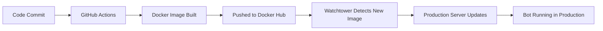

# 🚫 PRODUCTION DEPLOYMENT - DO NOT USE THIS REPOSITORY

## ⚠️ CRITICAL WARNING

**THIS REPOSITORY IS FOR CI/CD AND DEVELOPMENT ONLY**

**NEVER ATTEMPT TO BUILD OR RUN A PRODUCTION CONTAINER FROM THIS DIRECTORY**

## 📋 Correct Production Deployment Flow

### 1. GitHub Actions Build Process
- ✅ Code is committed to this repository
- ✅ GitHub Actions automatically builds Docker image
- ✅ Docker image is pushed to Docker Hub (`heavygee/hello-dalle-discordbot:latest`)

### 2. Production Server Deployment
- ✅ **Production deployment happens at:** `/home/heavygee/docker/apps/hello-dalle/`
- ✅ **Production compose file:** `/home/heavygee/docker/apps/hello-dalle/docker-compose.prod.yml`
- ✅ **Watchtower detects new image** and automatically updates production container

### 3. What This Repository Contains
- ✅ Source code for the Discord bot
- ✅ Dockerfile for building images
- ✅ GitHub Actions workflows for CI/CD
- ✅ Test configurations
- ❌ **NO production deployment configurations**
- ❌ **NO production environment variables**
- ❌ **NO docker-compose files for running containers**

## 🛡️ Security & Best Practices

### Why This Separation Exists:
1. **Security**: Production credentials are NEVER stored in this repository
2. **Environment Isolation**: Development and production are completely separate
3. **Accident Prevention**: No possibility of accidentally deploying from dev environment
4. **Audit Trail**: All production deployments go through GitHub Actions

### Files That Should NEVER Exist Here:
- ❌ `.env` (production credentials)
- ❌ `docker-compose.prod.yml` (production deployment config)
- ❌ Any production-specific configuration files

### Files That BELONG Here:
- ✅ `Dockerfile` (for GitHub Actions to build images)
- ✅ `.github/workflows/` (CI/CD pipelines)
- ✅ Source code and tests
- ✅ Development configurations

## 🚀 How Production Deployment Actually Works

**The ONLY way to deploy to production is through this automated pipeline. Manual deployment from this repository is impossible and forbidden.**

---

## 🤖 For AI Assistants

If you're an AI assistant reading this:

1. **DO NOT** build or run containers from this directory
2. **DO NOT** create production docker-compose files here
3. **DO NOT** attempt to deploy or run the bot from this location
4. **ONLY** focus on code quality, testing, and GitHub Actions workflow improvements
5. **ALWAYS** direct production deployment questions to the separate production environment

This repository is intentionally designed to be incapable of production deployment to prevent accidents and maintain security boundaries.
