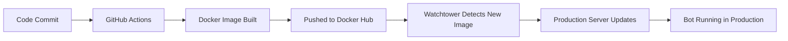

# 🚫 PRODUCTION DEPLOYMENT - DO NOT USE THIS REPOSITORY

## ⚠️ CRITICAL WARNING

**THIS REPOSITORY IS FOR CI/CD AND DEVELOPMENT ONLY**

**NEVER ATTEMPT TO BUILD OR RUN A PRODUCTION CONTAINER FROM THIS DIRECTORY**

## 📋 Correct Production Deployment Flow

### 1. GitHub Actions Build Process
- ✅ Code is committed to this repository
- ✅ GitHub Actions automatically builds Docker image
- ✅ Docker image is pushed to Docker Hub (`heavygee/hello-dalle-discordbot:latest`)
- ✅ Coolify deployment is automatically triggered on new releases

### 2. Production Server Deployment
- ✅ **Production deployment happens at:** `/home/heavygee/docker/apps/hello-dalle/`
- ✅ **Production compose file:** `/home/heavygee/docker/apps/hello-dalle/docker-compose.prod.yml`
- ✅ **Watchtower detects new image** and automatically updates production container

### 3. What This Repository Contains
- ✅ Source code for the Discord bot
- ✅ Dockerfile for building images
- ✅ GitHub Actions workflows for CI/CD
- ✅ Test configurations
- ❌ **NO production deployment configurations**
- ❌ **NO production environment variables**
- ❌ **NO docker-compose files for running containers**

## 🛡️ Security & Best Practices

### Why This Separation Exists:
1. **Security**: Production credentials are NEVER stored in this repository
2. **Environment Isolation**: Development and production are completely separate
3. **Accident Prevention**: No possibility of accidentally deploying from dev environment
4. **Audit Trail**: All production deployments go through GitHub Actions

### Files That Should NEVER Exist Here:
- ❌ `.env` (production credentials)
- ❌ `docker-compose.prod.yml` (production deployment config)
- ❌ Any production-specific configuration files

### Files That BELONG Here:
- ✅ `Dockerfile` (for GitHub Actions to build images)
- ✅ `.github/workflows/` (CI/CD pipelines)
- ✅ Source code and tests
- ✅ Development configurations

## 🚀 Deployment Automation Template

### For Repository Forks/Contributors

If you're forking this repository or want to set up automated deployment for your own instance, you can adapt the deployment automation in `.github/workflows/release.yml`.

#### Example Deployment Services

The workflow includes an example deployment trigger that can be adapted for various platforms:

**Supported Platforms (examples):**
- Coolify (as implemented)
- Railway
- Render
- Fly.io
- DigitalOcean App Platform
- Any service with REST API deployment triggers

#### This Repository's Setup

This specific repository:
- Pushes to **Docker Hub** (`heavygee/hello-dalle-discordbot`)
- Automatically triggers **Coolify deployment** on new releases
- Uses hardcoded Coolify configuration (since it's a private deployment)

#### How to Adapt for Your Deployment Service

1. **Configure Secrets**: Set up the following GitHub repository secrets:
   ```
   DEPLOYMENT_HOST=your-deployment-service.com
   DEPLOYMENT_APP_ID=your-app-identifier
   DEPLOYMENT_TOKEN=your-api-token
   ```

2. **Modify the API Call**: In `.github/workflows/release.yml`, update the deployment trigger step:
   ```yaml
   - name: Trigger deployment (Your Service)
     if: steps.semantic.outputs.new_release_published == 'true'
     env:
       DEPLOY_TAG: ${{ steps.semantic.outputs.new_release_version }}
     run: |
       # Replace with your deployment service's API endpoint
       url="https://YOUR-SERVICE/api/deploy?app=${{ secrets.DEPLOYMENT_APP_ID }}&version=${DEPLOY_TAG}"

       for i in 1 2 3; do
         echo "Triggering deployment: $url (attempt $i)"
         if curl --fail -fsSL "$url" -H "Authorization: Bearer ${{ secrets.DEPLOYMENT_TOKEN }}"; then
           echo "Deployment triggered successfully."
           exit 0
         fi
         echo "Retrying in $((i*5))s..."
         sleep $((i*5))
       done

       echo "Failed to trigger deployment after 3 attempts."
       exit 1
   ```

3. **Deployment Timing**: The trigger runs after:
   - ✅ Tests pass
   - ✅ Semantic release creates new version
   - ✅ Docker images are built and pushed to your registry (Docker Hub, GHCR, etc.)

#### Security Notes
- 🔐 **Never hardcode secrets** in workflow YAML
- 🔐 **Use GitHub repository secrets** for all authentication
- 🔐 **Test your deployment endpoint** before relying on automation
- 🔐 **Include retry logic** for network reliability

## 🚀 How Production Deployment Actually Works



**The ONLY way to deploy to production is through this automated pipeline. Manual deployment from this repository is impossible and forbidden.**

---

## 🤖 For AI Assistants

If you're an AI assistant reading this:

1. **DO NOT** build or run containers from this directory
2. **DO NOT** create production docker-compose files here
3. **DO NOT** attempt to deploy or run the bot from this location
4. **ONLY** focus on code quality, testing, and GitHub Actions workflow improvements
5. **ALWAYS** direct production deployment questions to the separate production environment

This repository is intentionally designed to be incapable of production deployment to prevent accidents and maintain security boundaries.
